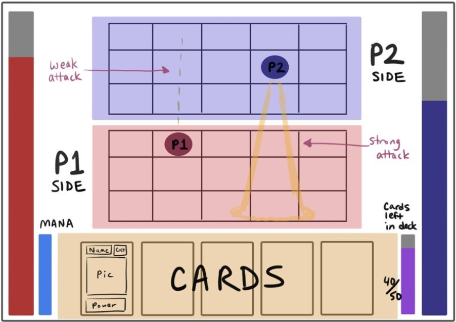

# Design Document
## Beach Battle Bonanza
### By: Camillia Moore, Jason Bui, and Zhong (June) Chai

### Youtube Links to Inspirations

[Mega Man Battle Network 6 for Gameboy Advance](https://youtu.be/rijz3zamK-w?si=DaAMpN1UEgNRTsSp&t=12)

[One Step From Eden (Inspired by the Mega Man Battle Network series)](https://www.youtube.com/watch?v=0ZZuo7Xpmqs )

## Game Description

Our game would play out like the two game examples listed above, but it would be PvP only. Actions happen in real time with movement restricted to a tile grid. As you can see in the trailers, the player will be able to dodge attacks by moving on the grid. Attacks will have a set path and hitbox. Some attacks will go across in a straight line, others might zigzag or hit in an arc. The objective would be to reduce the health of the opponent to 0, while dodging attacks to make sure they can’t do the same to you. Each player has a hand of 5 cards. After using a card, the empty slot would be replaced with another card in your deck. After using every card in the deck, the deck would refill.

#### Genre:

A hybrid 2-player action game and card battler

#### Camera Position:

Top-down fixed camera, with both players’ actions visible on the screen

#### Gameplay and Objective:

The player’s objective is to lower the opponent's HP to zero. They can achieve this by using the cards that they are dealt to deal attacks to their opponent. While doing so, the player must also dodge their opponent's attacks, so that they do not get hit and lose HP.

#### Visual Entities:

Two player characters, a traversable 3x5 grid for each character, a health bar for each character, an area that displays the current cards in the player’s hand, a Mana bar, and a deck gauge showing the number of cards remaining in the player’s deck.

#### Interaction Types:

Quick snappy movement between grid squares and faced paced attacks through playing different cards in real time.

#### Why is this game fun:

The competitive aspect and timing of shooting and dodging attacks in a fast-paced environment will be a fun experience. Picking out the right card to use and strategize will reward clever thinking and fast reflexes.

## Development Strategy

#### Milestone 1 (Nov 15 Demo and Nov 19 Group Status Report Progress):

- June: Set up game skeleton, classes, and game screens; add placeholder images
- Jason: Basic networking, have two clients connect and send/receive one variable over
- Camillia: Set up basic attack shooting and damage interaction
- All: Each person finishes a description of a character and their attacks 

#### Milestone 2 (Nov 29):

- June: Finish character sprites and add basic animation, add HP bar and Mana gauge animation systems 
- Jason: Networking complete: com.beachbb.game.Player positions, attack information, and game states should be sent and received back and forth.  
- Camillia: Multiple different cards dealt to the player automatically, dictating which attacks they can use, along with code to support choosing between different characters before the match starts 

#### Milestone 3 (Dec 6 Showcase):

- Fix bugs, smooth out interactions, finish the game 

## High Bar

- 3 different characters: Each character will have their own deck of cards and their own different attacks. Each character will also have their own theme and background. This will increase variety in the gameplay. 
- Fully custom assets: Custom artwork, animation, music, and sound effects made to make the game stand out and have an identity of its own, especially when compared with the inspiration material 
- Lots of varied, unique, and interesting cards to use: Cards will provide a variety of effects, with differences in attack animations and hitboxes and possibly buffs. With each character having their own attacks, cards should feel unique. 
- Using multiple cards together to create stronger and more varied attacks: If you have 2 of the same basic shot cards next to each other in your hand, it would be cool if you could play them at the same time to combine them into a more powerful version of that basic attack. 

## Low Bar Checklist

- Movement along a confined grid: The players will both be moving horizontally or vertically on a 3x5 grid. They cannot exit the grid. 
- Deck of cards: The deck will be auto dealt and determine the attacks that you can use. The player will have a hand of 5 cards and as they use a card, the slot in their hand will be replaced with a card from the deck. After using all cards in the deck, the deck will be refilled. 
- Networked multi-play with your opponent: The game is a two player PvP game. Game information will be transferred from player to player using networking. Game information will include things such as player positions, attacks, and game states. 
- Ability to use the cards and hit your opponent with attacks: Each card will correspond to an attack that can be used to harm your opponents. 
- Victory and Defeat states when one player runs out of HP: When your HP drops to 0, you lose, and the game takes you to a defeat screen. When your opponent's HP drops to 0, you win, and the game takes you to a victory screen. 
- At least one playable character: The players should be able to have access to a deck of cards and be able to move around a character, even if that character is a simple placeholder.

## Complexity Rubric

- Realtime Game (15) – Actions in the game will occur in real-time. Movements and attacks will occur in real-time.
- Multiplayer (10) – The game is intended to be a PvP game. The players will face off against each other and try to use their attacks to reduce the opponent’s HP to 0 while dodging their opponent’s attacks.
- Networking (50) – The game will use networking to transfer important information between the two players, such as player positions, and attack information.
- Power ups (20) – The game will feature cards that grant different attacks when used or other buffs. These different attacks will come with different animations.
- Art (20) – The game will feature complex artwork with many assets and animation sequences. The attacks will probably require the most artwork and extensive animations.
- Total: 115 